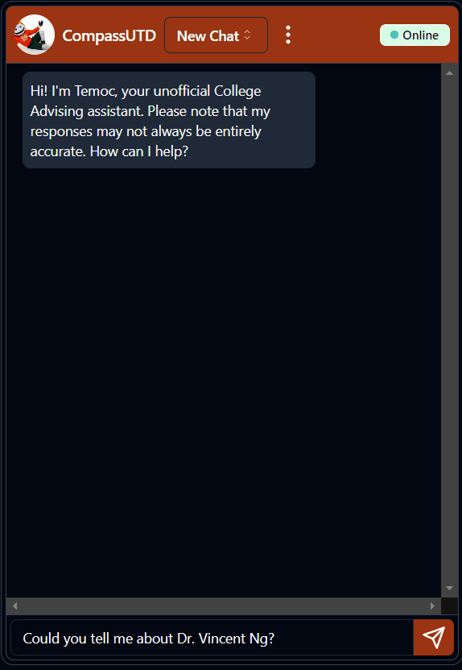
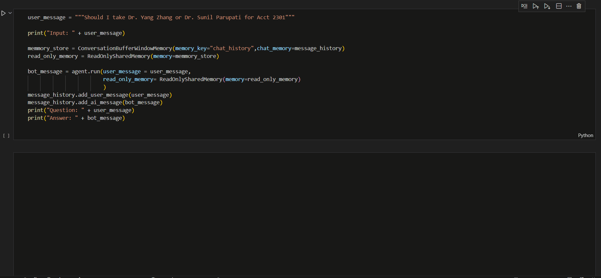

# [CompassUTD🧭](https://compass-utd.vercel.app/)

An unofficial advisor chatbot that provide up-to-date information about The University of Texas at Dallas powered by Langchain 🦜️🔗 and Google's PaLM 2.

## Demo

<div style="text-align: center;">
  
  
</div>

## Features

You can do all of this with CompassUTD🧭

- Searching for course information and descriptions using natural language or shorthand names (e.g., "Comp Arch" instead of "CS 2340: Computer Architecture").
- Providing professor ratings from RateMyProfessors.com for UT Dallas faculty.
- Offering information about the majors and minors available at UT Dallas.
- Supplying general information about UT Dallas, such as tech support, parking, and more.
- Providing details about staff, schools, and departments, including contact information, office locations, hours, and more.
- Keeping users informed about the latest news and events at UT Dallas.
- And more to come!

## Architecture

### High level architecture diagram


### How does it work

- CompassUTD utilized Google PaLM 2's reasoning capabilities to generate accurate answers.
- PaLM 2 will ultilize Langchain's tools and the Programmable Search Engine to conduct research and locate the correct information.
- MongoDB is employed to store chat messages, enabling PaLM 2 to retain previous conversations for contextual understanding. It also generate a SessionId token so that the user can save their chat history in the cookies and enable them to see past messages.

The process of sending a message and then arrive at a conclusion follow the paper ReAct. The steps are as follow:

1. Users initiate interaction with the chatbot via the web app.
2. The web app transmits the user's message and a sessionId token to the FastAPI server deployed on GCP's Cloud Run container.
3. The FastAPI server checks MongoDB to determine if the user has any previous messages stored in the database.
4. Vertex AI's PaLM 2 model receives the current message along with the previous message retrieved from MongoDB.
5. Utilizing the current and previous messages, PaLM 2 "reason" on the appropriate course of action to generate a response. This is the "Reason" in "ReAct"
6. PaLM 2 "acts" on its plan by utilizing Langchain's microservices deployed on the same Cloud Run instance. This is the "Action" in "ReAct"
7. If the initial response is unsatisfactory, steps 5 and 6 (the "ReAct" plan) are repeated until a satisfactory response is obtained or a timeout occurs.
8. The response is then sent back to the FastAPI server, allowing the web app to retrieve the result by calling the FastAPI server.

This approach enables the chatbot to achieve high accuracy and retain conversation context, resulting in a more personalized user experience.

## Getting started with local testing

If you are interested in the frontend, check out [Arihan's frontend github repo](https://github.com/arihanv/CompassUTD)

Here are the steps to run this project locally or deploy it to Google Cloud Platform

1. Create a Google Cloud Platform account and enable Vertex AI and the required APIs for the project. Then create a service account, and save it API service account key as `google_key.json` and put it in `train-and-finetune` and `fast_api_app/app` folder.

2. Create a MongoDB Atlas account and create a cluster Save the connection string as `MONGODB_LOGIN` and `MONGODB_LOCATION` for later.

3. Get the API key to perform the search. Then create 3 search engines that match the following and save individual `Search Engine ID`:

|                | Course Search | Degree Search | Random Search |
|----------------|--------------------------|-------------------------------|-------------------------------|
| Search sites   | - catalog.utdallas.edu/<br/>\*/\*/courses/***** | - catalog.utdallas.edu/<br/>202*/\*/programs/\*/*  | - catalog.utdallas.edu/\*/\*/home/* <br/> - bpb-us-e2.wpmucdn.com/sites.utdallas.edu/* <br/> - \*.utdallas.edu/* |
| Excluded sites | - catalog.utdallas.edu/<br/>\*/\*/courses/school/*  | *None* | - dox.utdallas.edu/syl*<br/>- catalog.utdallas.edu/* |

4. You have all the required information to create a `.env` file. Create a .env file in the `fast_api_app/app` and `train-and-finetune` folder with the following content. Replace the values with your own.

```
MONGODB_LOGIN = `REPLACE`
MONGODB_LOCATION = `REPLACE`

GOOGLE_APPLICATION_CREDENTIALS = google_key.json
GOOGLE_SEARCH_API = `REPLACE`
COURSE_SEARCH_ID = `REPLACE`
RANDOM_SEARCH_ID = `REPLACE`
DEGREE_SEARCH_ID = `REPLACE`
```

5. Now you should be able to run the project locally in `train-and-finetune/ai_sandbox.ipynb`.



6. If you would like to run the FastAPI server. Run the following commands in the terminal.

```
cd fast_api_app

# For in browser testing
uvicorn app.main:app --reload

# For Docker Container testing
local_docker_test.cmd

# For Google Cloud Run deployment
deploy_to_cloud_run.cmd
```

7. Have fun! Open a GitHub issue if you have any questions. 
